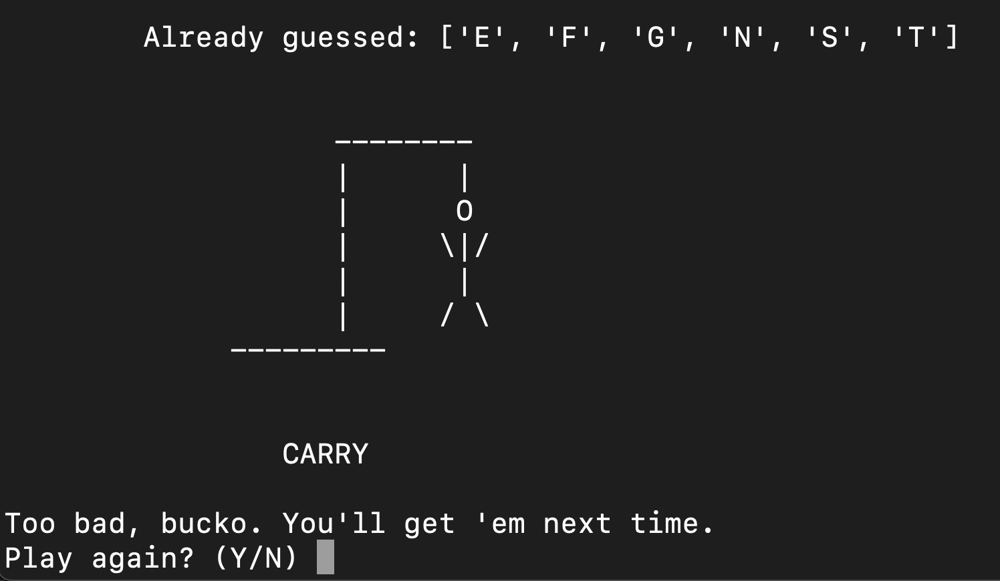

# Sassy Hangman

In one of my first Python projects, I wanted to test my understanding of the language basics by building a Hangman game.

To add a bit of flair, I've added randomized, campy lines for the... executioner, if you will. 

## To run

Once you have the scripts loaded, run `python main.py` with an optional argument for the lives you'd like to have, from 1 up to 9. The default is 6.
e.g. `python main.py 8`

---

### Profanity Warning 🤬

The wordlist **does** include swearwords, therefore it's not impossible for the game answer to be obscene - thought it would be worth noting.

---

### Requirements
You will find this on the light side, with the only thing needed to run the game being the 'requests' library to pull the list of 10,000 words from an MIT page.

Run: `pip install requests` to install.

If this doesn't work, try replacing `pip` with `pip3`.

### What I learned

This was actually a blast. I got to practice the Python syntax, reinforce my knowledge of `if` statements, `while` loops, Classes and functions. I learned to abstract my code as a principle of OOP and break down my functions into single tasks. I got to practice bash/zsh as well as my very first usage of `git add`s, `commit`s and `push`es. I can see why github is as huge as it is. It's so smooth. ❤️‍🔥

I'm sure I have a way to go yet as I'm only starting but this feels like a promising, if basic, foundation for my future work.

